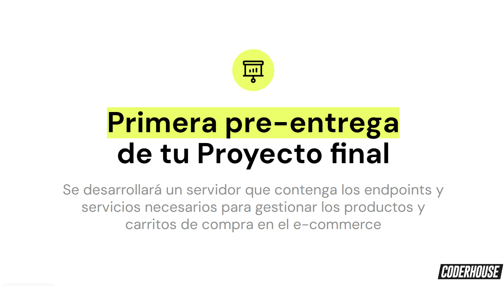
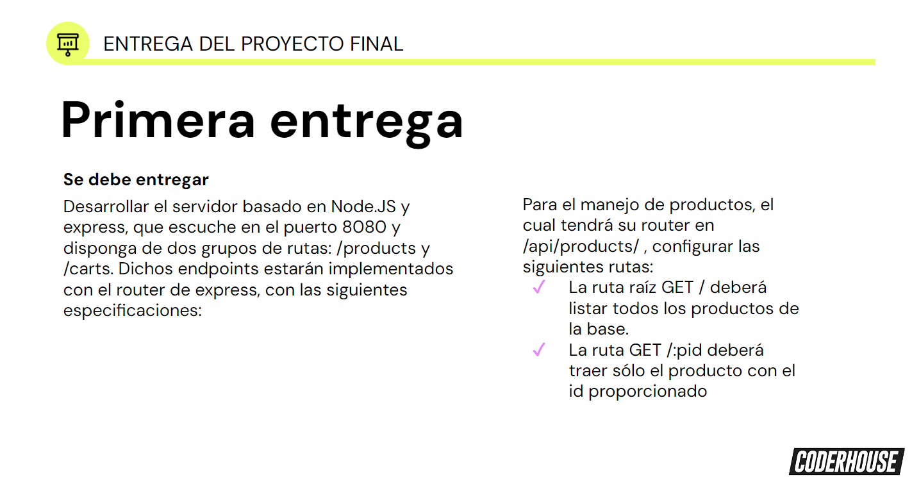
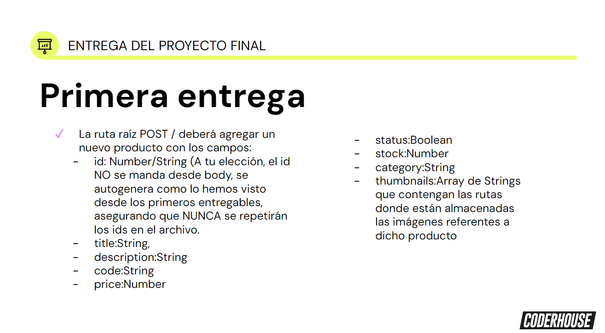
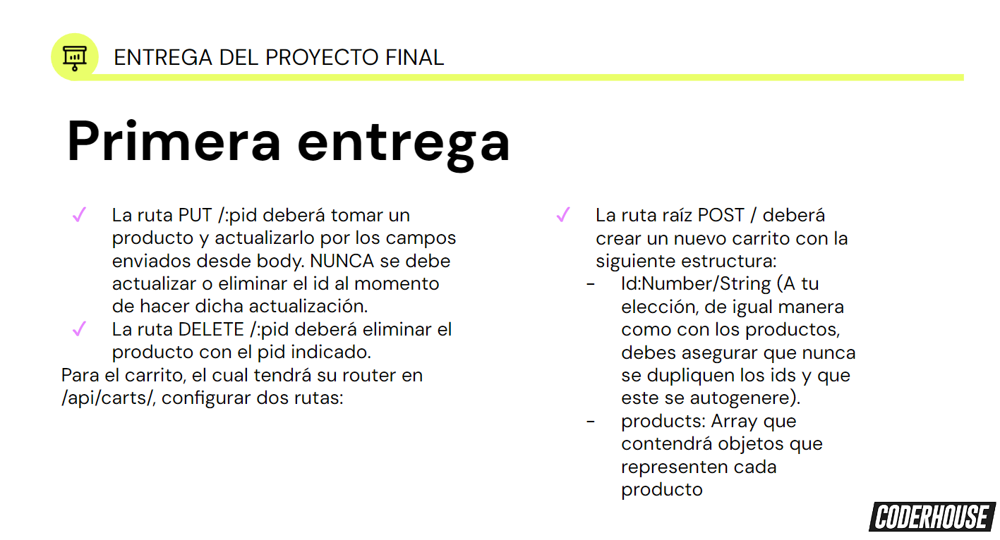
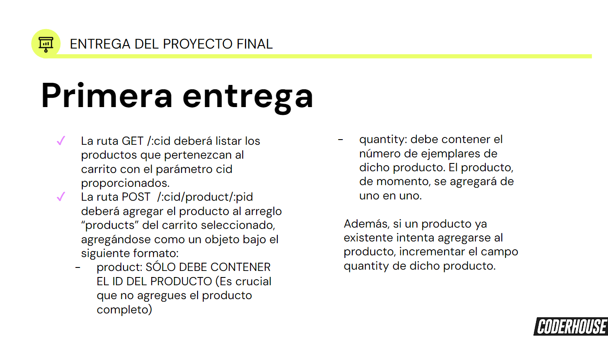
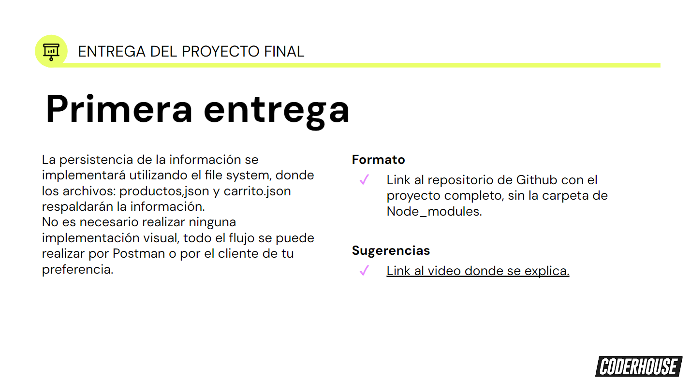

# Curso de Programación Backend CoderHouse

# Consigna








### Run Command :

Antes de comenzar ejecutar este comando:

```sh
npm i //Este comando instalara todas las dependencias usadas en este proyecto
```

Lo siguiente sera iniciar el servidor con:

```sh
npm run dev
```

## Proyect Structure :

**App**

Contamos con el fichero principal **app**, este se usa para generar un servidor mediante express en el puerto **8080** teniendo como ruta principal **http://localhost:8080/api**

**Controllers Structure**

La carpeta **controllers** cuenta con los siguiente ficheros **productManager** y **cartManager**. Estos, a su vez contienen internamente los siguientes métodos respectivamente para el manejo de productos:

**productManager.js:**

```
- addProduct
- getProducts
- getProductByid
- updateProduct
- deleteProduct
```

**cartManager.js structure:**

```
- getCarts
- getCartbyId
- addCart
- addProductToCart
```

**Models Structure**

En la carpeta **models** contamos con **products.json** **carts.json**. Estos ficheros seran manipulado por los ficheros **productManageer** **cartManager**.

**product.json structure:**

```
-id: Number/String (A tu elección, el id NO se manda desde body, se autogenera como lo hemos visto 
desde los primeros entregables, asegurando que NUNCA se repetirán los ids en el archivo).
-title: String,
-description: String
-code: String
-price: Number
-status: Boolean
-stock: Number
-category: String
-thumbnails: Array de Strings que contengan las rutas donde están almacenadas las imágenes referentes a -dicho product

```

**carts.json structure:**

```
-id: String (id del carrito)
{
-pid: String (id del producto)
-quantity: Number
}
```


